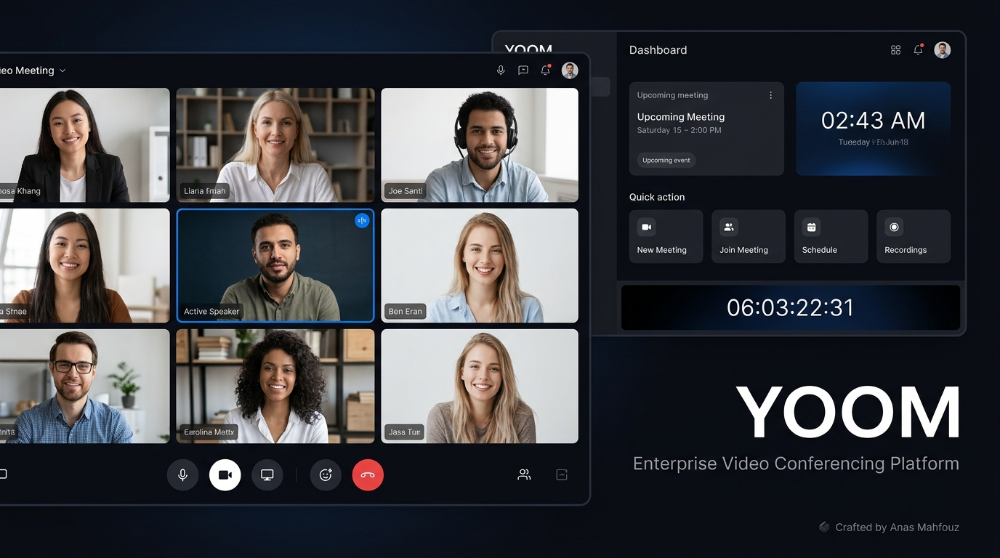
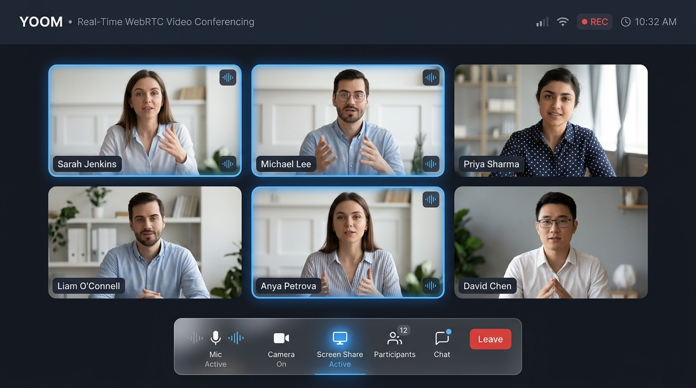
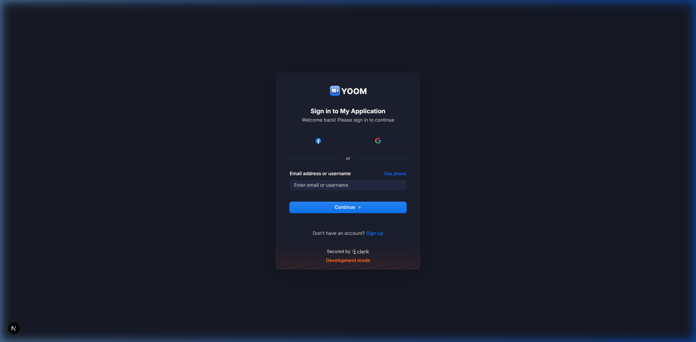
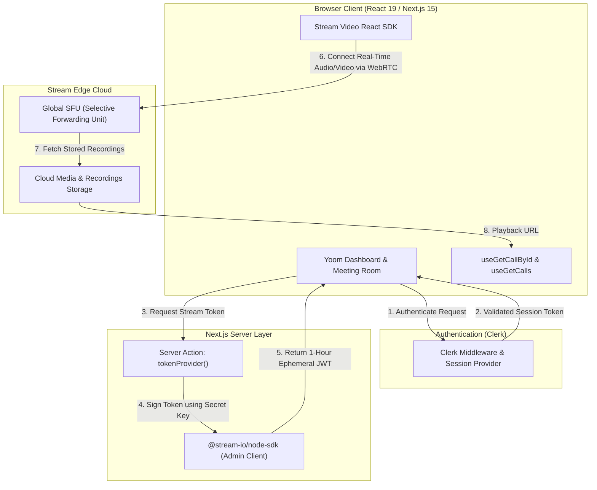

<div align="center">

# YOOM

### Enterprise-Grade Video Conferencing Platform

A modern, high-performance video conferencing application built with **Next.js 15 (App Router)**, **React 19**, **TypeScript**, **Stream Video SDK**, and **Clerk Authentication**. Engineered for ultra-low latency, crystal-clear audio/video, and seamless real-time collaboration.

[](https://nextjs.org/)
[](https://react.dev/)
[](https://www.typescriptlang.org/)
[](https://tailwindcss.com/)
[](https://getstream.io/video/)
[](https://clerk.com/)
[](./LICENSE)

<br/>



</div>

---

## 📌 Overview

**YOOM** is an enterprise-ready video conferencing platform designed to mirror and enhance the core capabilities of Zoom. It solves the complexity of orchestrating distributed, low-latency audio/video streams by combining Next.js Server Components with Stream's global Selective Forwarding Unit (SFU) network.

### What Makes It Technically Compelling:
* **Server-Validated Token Generation**: Eliminates client-side credential exposure by securing Stream API tokens via Next.js Server Actions linked with Clerk session claims.
* **Granular Media Stream Control**: Pre-call device negotiation, live camera/mic toggling, responsive speaker active-detection, and multi-layout rendering (Paginated Grid, Speaker-Left, Speaker-Right).
* **Deterministic Room Routing**: Dynamic route parameters paired with persistent Personal Meeting IDs and one-click shareable invitation links.
* **Recording Lifecycle Management**: Direct synchronization with cloud-persisted meeting recordings and in-app streaming playback.

---

## ✨ Features

| Feature | Description | Status |
| :--- | :--- | :---: |
| **Instant Meetings** | Create and launch an ad-hoc video room immediately with unique room IDs. | ✅ Production Ready |
| **Scheduled Meetings** | Plan meetings in advance with integrated date/time picker and description. | ✅ Production Ready |
| **Personal Meeting Room** | Dedicated, permanent meeting room URL for recurring 1-on-1s and standups. | ✅ Production Ready |
| **Multi-Layout Views** | Switch seamlessly between Paginated Grid, Speaker Left, and Speaker Right layouts. | ✅ Production Ready |
| **Device Pre-Join Setup** | Test camera and microphone feeds with real-time video preview before entering calls. | ✅ Production Ready |
| **In-Call Controls** | Mute/unmute microphone, toggle video, screen share, view participant roster, and end call. | ✅ Production Ready |
| **Participant Management** | Live roster showing connected attendees, active speaker indicators, and participant stats. | ✅ Production Ready |
| **Meeting History & Recordings** | Dedicated views for Upcoming Calls, Previous Meetings, and Cloud Video Recordings. | ✅ Production Ready |
| **Secure Authentication** | Multi-factor, social, and email-based authentication powered by Clerk. | ✅ Production Ready |
| **Responsive Dark Theme** | Polished glassmorphism UI tailored for desktop, tablet, and mobile displays. | ✅ Production Ready |

---

## 📸 Visual Showcase

<div align="center">

### Real-Time Video Meeting Experience


### Secure Authentication Screen


</div>

---

## 🏗️ Technical Architecture

The following diagram illustrates the interaction between client components, Next.js Server Actions, Clerk Authentication, and the Stream Video edge network:



---

## 💻 Tech Stack

### Frontend & Framework
* **Next.js 15.1.7** – App Router, Server Components, and optimized image rendering.
* **React 19.0.0** – Concurrent rendering engine and state management.
* **TypeScript 5.7.3** – Strict type-safety across all components, hooks, and actions.
* **Tailwind CSS v4** – Modern atomic styling and custom glassmorphism design tokens.
* **Radix UI Primitives** – Accessible headless dialogs, dropdowns, slots, and toast notifications.
* **Lucide React** – Clean, lightweight vector iconography.

### Real-Time Infrastructure
* **Stream Video React SDK (`@stream-io/video-react-sdk`)** – Client-side WebRTC call orchestration.
* **Stream Node SDK (`@stream-io/node-sdk`)** – Secure server-side token generation and call querying.

### Identity & Security
* **Clerk Next.js (`@clerk/nextjs`)** – Session cookies, route protection middleware, and OAuth provider orchestration.

---

## 📁 Project Structure

```bash
zoom-clone-main/
├── actions/
│   └── stream.actions.ts         # Server action for generating secure Stream tokens
├── app/
│   ├── (auth)/                   # Authentication route group (sign-in, sign-up)
│   ├── (root)/
│   │   ├── (home)/               # Protected dashboard route group
│   │   │   ├── page.tsx          # Main dashboard with meeting action cards
│   │   │   ├── personal-room/    # Dedicated personal room view
│   │   │   ├── previous/         # Previous call history
│   │   │   ├── recordings/       # Recorded meeting playback
│   │   │   └── upcoming/         # Scheduled upcoming calls
│   │   ├── layout.tsx            # StreamClientProvider injection
│   │   └── meeting/[id]/         # Dynamic meeting room route & client
│   ├── globals.css               # Tailwind CSS v4 directives & theme tokens
│   └── layout.tsx                # Root layout, ClerkProvider, Toaster, Metadata
├── components/
│   ├── ui/                       # Radix UI wrapper components (button, dialog, toast, etc.)
│   ├── modals/                   # Meeting creation, scheduling, and join dialogs
│   ├── call-list.tsx             # Dynamic card grid for ended/upcoming/recordings
│   ├── footer.tsx                # Professional copyright & developer attribution
│   ├── home-card.tsx             # Interactive dashboard action cards
│   ├── meeting-card.tsx          # Card view with attendee avatars and action triggers
│   ├── meeting-room.tsx          # Full-screen meeting interface with layout selectors
│   ├── meeting-setup.tsx         # Pre-join camera/mic check and preview
│   ├── navbar.tsx                # Global navigation bar with Clerk user button & GitHub link
│   └── sidebar.tsx               # Responsive navigation sidebar
├── config/
│   └── index.ts                  # Site metadata, OpenGraph, Twitter tags, attribution
├── constants/
│   └── index.ts                  # Navigation routes and static assets
├── docs/
│   └── assets/                   # Social preview banners, UI screenshots
├── hooks/
│   ├── use-get-call-by-id.ts     # Hook for querying single call state
│   └── use-get-calls.ts          # Hook for querying ended, upcoming, and recorded calls
├── lib/
│   └── utils.ts                  # ClassName merging utility (clsx + tailwind-merge)
├── providers/
│   └── stream-client-provider.tsx# Stream Video Client initialization provider
├── middleware.ts                 # Clerk route protection rules
├── .env.example                  # Template environment variables
├── package.json
└── tsconfig.json
```

---

## 🚀 Getting Started

### Prerequisites
* **Node.js** 20.x or higher
* **pnpm** (or **npm** / **yarn**)
* Free **[Clerk](https://clerk.com)** account
* Free **[GetStream](https://getstream.io)** account

### 1. Clone the Repository
```bash
git clone https://github.com/aanasmahfouz/zoom-clone.git
cd zoom-clone
```

### 2. Install Dependencies
```bash
npm install
# or
pnpm install
```

### 3. Configure Environment Variables
Copy `.env.example` to `.env.local`:
```bash
cp .env.example .env.local
```

Fill in your respective credentials:
```env
# Clerk Authentication
NEXT_PUBLIC_CLERK_PUBLISHABLE_KEY=pk_test_...
CLERK_SECRET_KEY=sk_test_...

NEXT_PUBLIC_CLERK_SIGN_IN_URL=/sign-in
NEXT_PUBLIC_CLERK_SIGN_UP_URL=/sign-up

# Stream Video SDK
NEXT_PUBLIC_STREAM_API_KEY=...
STREAM_SECRET_KEY=...

# App URL
NEXT_PUBLIC_BASE_URL=http://localhost:3000
```

### 4. Run Development Server
```bash
npm run dev
# or
pnpm dev
```

Open [http://localhost:3000](http://localhost:3000) in your browser.

### 5. Build for Production
```bash
npm run build
npm run start
```

---

## 🛡️ Security & Privacy Practices

* **No Hardcoded Secrets**: All API secrets are isolated to server environments and excluded from client bundles.
* **Strict Route Guards**: Non-authenticated requests are intercepted by Next.js edge middleware before rendering protected pages.
* **Ephemeral JWTs**: Stream tokens generated by server actions expire in 60 minutes, preventing replay vulnerabilities.
* **Sanitized Git History**: Clean `.gitignore` enforces local privacy for all `.env*.local` configurations and temporary build caches.

---

## 👨‍💻 Author

**Anas Mahfouz**

* GitHub: [@aanasmahfouz](https://github.com/aanasmahfouz)
* Project Repository: [zoom-clone](https://github.com/aanasmahfouz/zoom-clone)

---

## 📄 License

This project is licensed under the **MIT License** - see the [LICENSE](./LICENSE) file for details.

<div align="center">
  <sub>Copyright © 2026 Anas Mahfouz. All rights reserved.</sub>
</div>
